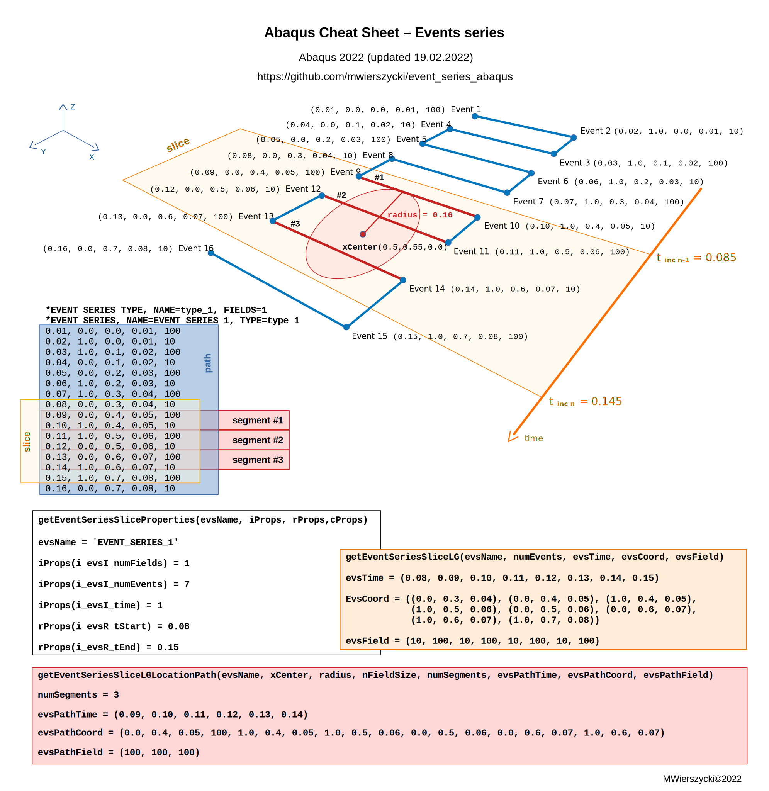

# Event series in Abaqus

Event series can be used to define fields that vary in both time and space. They work in combination with a library of utility routines that can be invoked from two user subroutines `UMDFLUX` and `UEPACTIVATIONVOL`.

The field described with the event series is a piecewise-defined function. There is a path in 3D space.  The events define a start and an end points of path segments. Each segment of that path has a constant value of the field. Abaqus doesn't interpolate field values between events.

In the INP file path, segments are defined using `*EVENT SERIES` keyword. Each data line of the keyword defines an event. First data field defines time and the 2nd, 3rd and 4th data fields define the point in space of the event. The last field defines field value for the segment, started by the event:

```
*EVENT SERIES, NAME=event_series_1, TYPE=event_series_type_1
** time, x, y, z, field 1
0.0, 1.0, 1.0, 1.0, 250
0.1, 2.0, 2.0, 1.0, 0.
0.2, 3.0, 3.0, 1.0, 0.
0.3, 4.0, 4.0, 1.0, 0.
0.4, 5.0, 5.0, 1.0, 0.
0.5, 6.0, 6.0, 1.0, 0.
```
In the Abaqus terminology several lines (one by one) are called slice of events. This term refers to data itself, not to the path directly.

More fields can be defined. The number of fields is given as `FIELDS` option of the `*EVENT SERIES TYPE` definition:
```
*EVENT SERIES TYPE, NAME=event_series_type_1, FIELDS=n
```
The set of utility routines can be used to access event series data from Abaqus/Standard user subroutines. These utility routines can be called to get a slice of event series data from `UMDFLUX` and `UEPACTIVATIONVOL` subroutines. The slice can be selected based on the current time increment and distance from a so-called center point as well.

There are three utility routines:
 - `getEventSeriesSliceProperties` - to query the properties of event series
 - `getEventSeriesSliceLG` - to get the sequence of all events in the slice
 - `getEventSeriesSliceLGLocationPath` - to get the list of segments located within the provided distance to a center point

The routine getEventSeriesSliceProperties gets properties of a slice of the event series data:
 - number of fields in the event series,
 - number of events in the current slice,
 - time of the first and the last event in the slice.

The routine `getEventSeriesSliceLG` reads the slice based on the current time range. The current time range covers time points from previous increment time (the closest before)  to current increment time (the closest after).

The routine `getEventSeriesSliceLGLocationPath` returns the list of path segments from the current slice found within the provided distance (defined using variable `radius`) to a center point (defined using variable `xCenter`).

The INP syntax of the event series is well explained in Abaqus documentation. However, the access to the defined fields using event series from the user subroutines can be much more challenging. The graphical cheat sheet can help to use event series in `UMDFLUX` subroutines:



A simple example of using event series in `UMDFLUX` subroutine is available as well. The full source code of subroutine and INP file can be found here:
 - [umdflux_dc3d8_1elem-event_series.inp](umdflux_dc3d8_1elem-event_series.inp)
 - [umdflux_dc3d8_1elem-event_series.f](umdflux_dc3d8_1elem-event_series.f)

Happy using event series in Abaqus!
